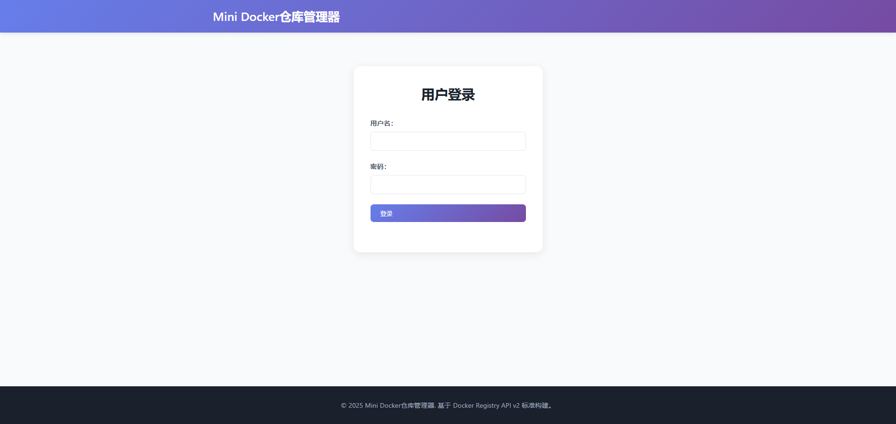
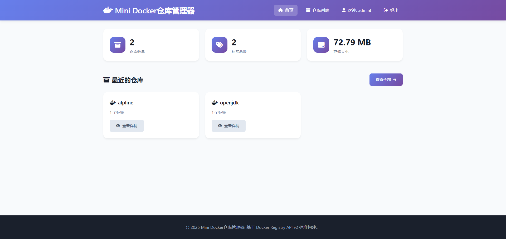
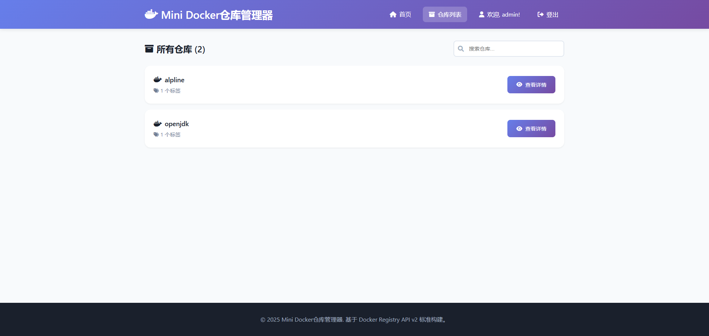
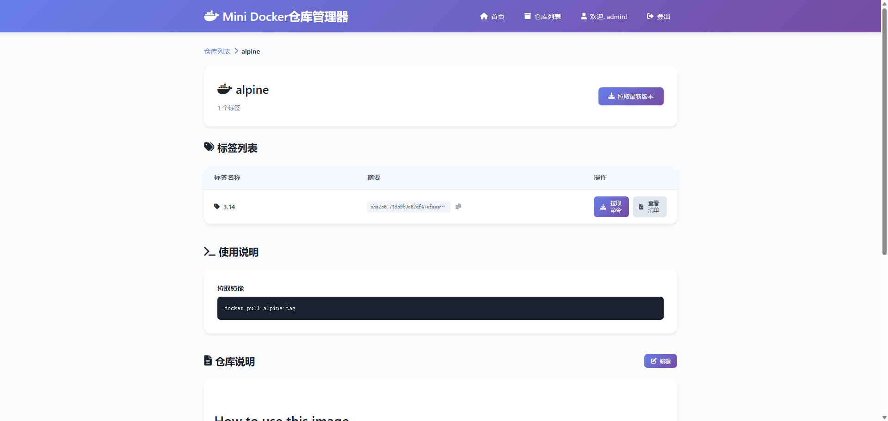
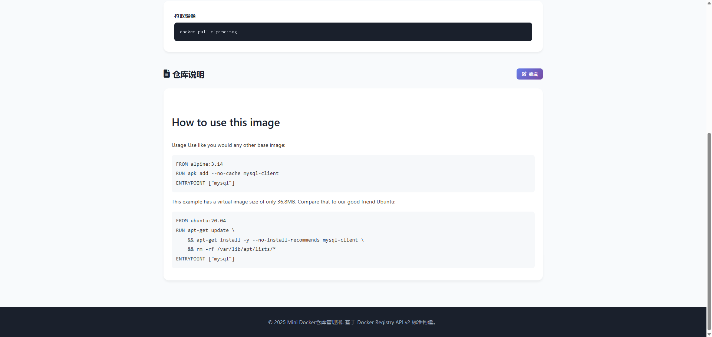

# Mini Docker仓库管理器

用go语言编写的一个功能完整的Docker仓库管理器，类似于Nexus，支持Docker Registry API v2协议和直观的Web管理界面。

特点就是简单好用，部署简单，不依赖任何环境，可以直接部署，也可以docker部署。

功能还在建设中，欢迎提issue和PR，贡献。
邮箱：1211038138@qq.com
## 截图
登录

首页

仓库列表

仓库详情1

仓库详情2


## 特性

### 主要功能

- **Docker Registry API v2 支持**
  - 完整的Docker Registry API v2协议实现
  - 支持镜像推送(push)和拉取(pull)
  - Manifest管理（GET/PUT/HEAD/DELETE）
  - Blob存储和检索
  - 分块上传支持
  - 仓库和标签列表

- **Web管理界面**
  - 直观的Web UI显示所有仓库
  - 实时统计信息（仓库数量、标签数量）
  - 仓库和标签的可视化管理
  - 响应式设计，支持移动设备

- **存储管理**
  - 文件系统存储
  - 分层目录结构
  - SHA256内容寻址
  - 上传状态跟踪

## 快速开始

### 环境要求

- Go 1.21+
- Docker（用于测试）

## windows使用
```json
{
  "builder": {
    "gc": {
      "defaultKeepStorage": "20GB",
      "enabled": true
    }
  },
  "experimental": false,
  "insecure-registries": [
    "192.168.30.65:7000"
  ]
}
```

### 打包
   ```bash
  # 构建Linux可执行文件
    set CGO_ENABLED=0
    set GOOS=linux
    set GOARCH=amd64
    go build -a -installsuffix cgo -o build\docker-registry-manager ./cmd
   ```
   window打包
   ```bash
   go build -a -installsuffix cgo -o build\docker-registry-manager.exe ./cmd
   ```

### 安装和运行

1. **克隆项目**
```bash
   git clone <repository-url>
   cd docker-registry-manager
```

2. **安装依赖**
```bash
  go mod tidy
```

3. **构建项目**
```bash
  go build -o build/docker-registry-manager ./cmd
```

4. **运行服务**
```bash
  go run build/docker-registry-manager -config=config.yaml
```
5. **开发**

```bash
  go run ./cmd
```

服务将在 `http://localhost:7000` 启动。

### 配置

编辑 `config.yaml` 文件来自定义配置：

```yaml
server:
  host: "0.0.0.0"
  port: 7000
  read_timeout: 30s
  write_timeout: 30s

storage:
  type: "filesystem"
  path: "./data"
  
registry:
  realm: "Docker Registry Manager"
  service: "docker-registry-manager"
  
logging:
  level: "info"
  format: "json"
  
web:
  enabled: true
  title: "Mini Docker仓库管理器"
auth:
  enabled: true
  username: admin
  password: admin
  
cors:
  enabled: true
  allowed_origins: ["*"]
  allowed_methods: ["GET", "POST", "PUT", "DELETE", "HEAD", "OPTIONS"]
  allowed_headers: ["*"]


```

## 使用方法

### 推送镜像

```bash
# 标记镜像
docker tag myimage:latest localhost:7000/myimage:latest

docker tag alpine:3.14 192.168.1.28:7000/alpine:3.14

# 推送镜像
docker push localhost:7000/myimage:latest

docker push 192.168.1.28:7000/alpine:3.14
```

### 拉取镜像

```bash
# 拉取镜像
docker pull localhost:7000/myimage:latest
```

### Web界面

访问 `http://localhost:7000` 查看Web管理界面：

- **首页**: 显示统计信息和最近的仓库
- **仓库列表**: 查看所有仓库和搜索功能
- **仓库详情**: 查看特定仓库的标签和manifest信息

### API端点

#### Docker Registry API v2

- `GET /v2/` - 检查API版本支持
- `GET /v2/_catalog` - 获取仓库列表
- `GET /v2/{name}/tags/list` - 获取仓库标签列表
- `GET /v2/{name}/manifests/{reference}` - 获取manifest
- `PUT /v2/{name}/manifests/{reference}` - 上传manifest
- `GET /v2/{name}/blobs/{digest}` - 获取blob
- `POST /v2/{name}/blobs/uploads/` - 开始blob上传
- `PUT /v2/{name}/blobs/uploads/{uuid}` - 完成blob上传

#### Web API

- `GET /api/repositories` - 获取仓库列表（JSON）
- `GET /api/stats` - 获取统计信息（JSON）

## 开发

### 项目结构

```
docker-registry-manager/
├── cmd/                    # 主程序入口
├── internal/
│   ├── api/               # API处理器
│   ├── config/            # 配置管理
│   └── storage/           # 存储接口和实现
├── web/
│   ├── static/            # 静态文件
│   │   ├── css/
│   │   └── js/
│   └── templates/         # HTML模板
├── data/                  # 数据存储目录
│   ├── blobs/            # Blob存储
│   ├── repositories/     # 仓库数据
│   └── uploads/          # 临时上传文件
├── config.yaml           # 配置文件
├── Makefile              # 构建脚本
└── README.md
```

## 部署

### 1.windows部署
1. 创建 `config.yaml` 文件，并配置好参数。
2. 双击docker-registry-manager.exe。

### 2.Linux部署
1. 创建 `config.yaml` 文件，并配置好参数。
2. 运行 ./docer-registry-manager 。


### 3.Docker部署

创建 `Dockerfile`:

```dockerfile
FROM golang:1.21-alpine AS builder
WORKDIR /app
COPY . .
RUN make release

FROM alpine:latest
RUN apk --no-cache add ca-certificates
WORKDIR /root/
COPY --from=builder /app/build/docker-registry-manager .
COPY --from=builder /app/config.yaml .
EXPOSE 7000
CMD ["./docker-registry-manager"]
```

构建和运行：

```bash
docker build -t docker-registry-manager .
docker run -p 7000:7000 -v /var/lib/registry:/root/data docker-registry-manager
```

## 故障排除

### 常见问题

1. **端口被占用**
   - 修改 `config.yaml` 中的端口配置
   - 或使用 `-config` 参数指定不同的配置文件

2. **存储权限问题**
   - 确保数据目录有正确的读写权限
   - 检查 `storage.path` 配置

3. **镜像推送失败**
   - 检查Docker daemon配置中的insecure-registries设置
   - 确保防火墙允许相应端口

### 日志调试

启用调试日志：

```yaml
logging:
  level: "debug"
  format: "text"
```

## 贡献

欢迎提交Issue和Pull Request来改进这个项目。

## 许可证

MIT License

## 技术栈

- **后端**: Go, Gorilla Mux, Logrus
- **前端**: HTML5, CSS3, JavaScript (ES6+)
- **存储**: 文件系统
- **协议**: Docker Registry API v2
- **UI**: 响应式设计，Font Awesome图标

